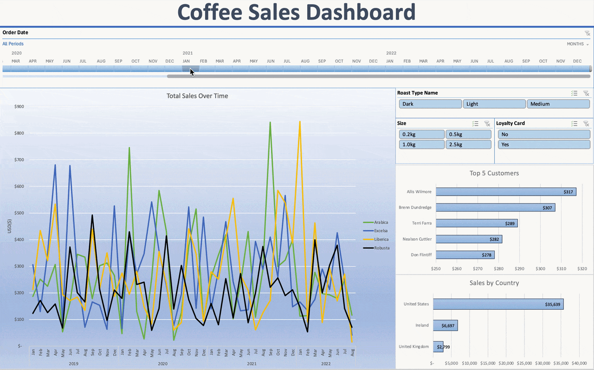

# Coffee Sales Dashboard (Excel)

## Overview
This project analyzes multi-year coffee sales performance using Microsoft Excel. The goal was to transform raw transactional data into a clean, interactive dashboard that highlights sales trends, customer performance, and geographic distribution.

The dashboard enables dynamic filtering by date, roast type, product size, and loyalty card usage to explore how different segments impact revenue.

---

## Tools Used
- Microsoft Excel
- Power Query
- Pivot Tables
- Data Cleaning & Transformation
- Data Aggregation
- Interactive Dashboard Design

---

## Data Preparation (Power Query)

The raw dataset was cleaned and transformed using Power Query:

- Standardized data types
- Removed inconsistencies and null values
- Structured time-based fields for trend analysis
- Prepared aggregated datasets for pivot analysis
- Ensured data model consistency for slicer interaction

---

## Dashboard Features

### Key KPIs & Visuals
- **Total Sales Over Time** segmented by roast type (Arabica, Excelsa, Liberica, Robusta)
- **Top 5 Customers** by total sales
- **Sales by Country**
- Multi-year performance analysis (2019–2022)

### Interactive Filters
- Order Date (timeline slicer)
- Roast Type
- Package Size
- Loyalty Card Status

These slicers dynamically update all visuals, enabling flexible business analysis.

---

## Interactive Dashboard Demo

---

## Business Insights Demonstrated
- Identified seasonal sales fluctuations across multiple years
- Compared revenue performance by roast type
- Highlighted top-performing customers
- Evaluated geographic revenue concentration
- Assessed the impact of loyalty program participation on sales

---

## Project File
The full interactive Excel dashboard can be downloaded from this repository.